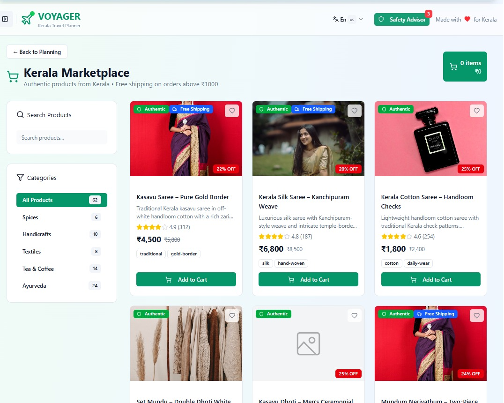
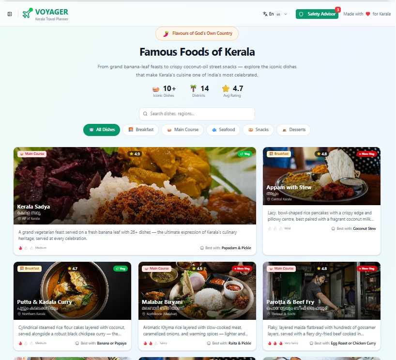
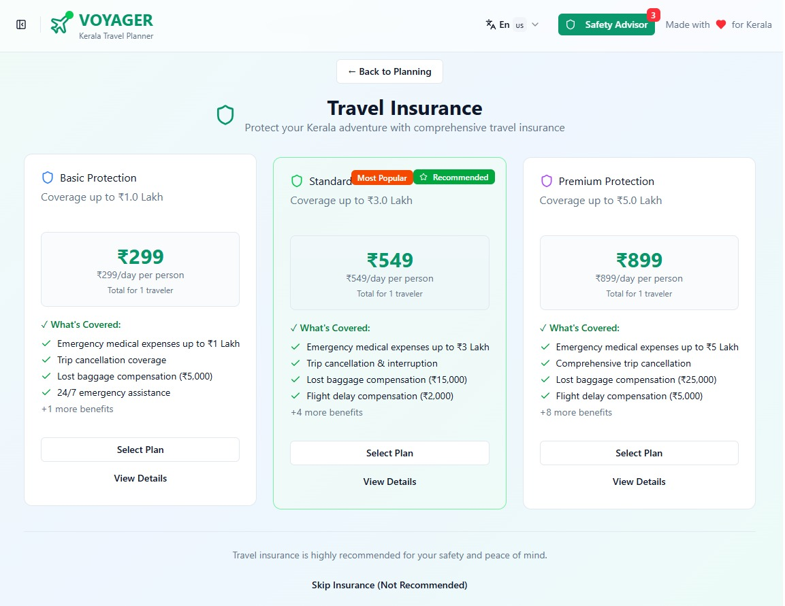

# Travel App Voyager

The original project is available at (https://boots-eagle-14542674.figma.site/)

## About the Project

Travel App Voyager is a travel planning platform designed to make the process of planning a trip simpler and more convenient. It brings destination search, itinerary suggestions, and recommendations for hotels and restaurants into one place. The project focuses on providing a clean and responsive interface that allows users to explore a destination and plan their trip without having to switch between multiple platforms.

## 📸 Screenshots

### Market Place

### Food Corner

### Travel Safety

### Virtual 360 degree View

## Features

The current prototype includes destination search, itinerary suggestions, and recommendations for hotels and restaurants. The interface is designed to be simple, responsive, and easy to navigate. The main idea is to provide users with a single platform for different parts of their travel planning process.

## Problem

Travelers often use different applications for finding destinations, planning itineraries, looking for hotels, and discovering restaurants. This can make the planning process time-consuming and inconvenient. Voyager aims to reduce this fragmentation by bringing these features together into a single travel planning experience.

## Tech Stack

The prototype was designed using Figma and developed as an interactive web experience using Figma SitesRuntime and Tailwind CSS.

## Running the code

Run `npm i` to install the dependencies.

Run `npm run dev` to start the development server.

## Future Scope

The current prototype can be further developed into a fully functional travel application. Future improvements include integrating real-time APIs for flights, hotels, and maps, along with AI-based personalization for generating itineraries based on user preferences.

The application can also be extended with secure user login, saved trips, and a backend for managing user data. A mobile version can be developed using React Native or Flutter.

## Expected Impact

Voyager aims to reduce the time and effort required to plan a trip by bringing different travel planning features together. It can help users discover suitable options, make better planning decisions, and have a more convenient travel experience.

## 🏆 Hackathon

- Developed as part of **Smart India Hackathon (SIH) 2025**
- Further improved and enhanced in **Smart India Hackathon (SIH) 2026**

## 👥 Contributors (2025-2026)

- **M Punith Reddy**
- **Thaejashree Karthika Chidambaram**
- **Kawini G**
- **Upakkara Dattu**
- **Devika Prathap**
- **Shobitha G**
- **Varun T G**
- **DSVG Pranay**
